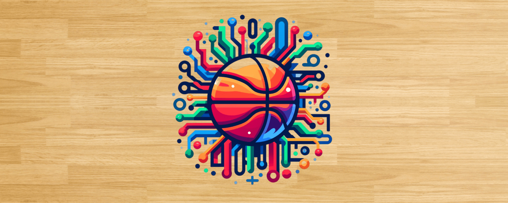
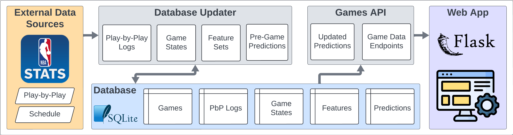
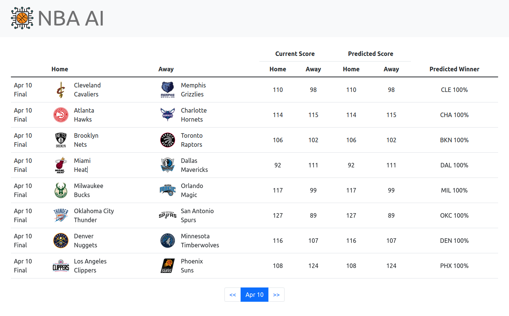
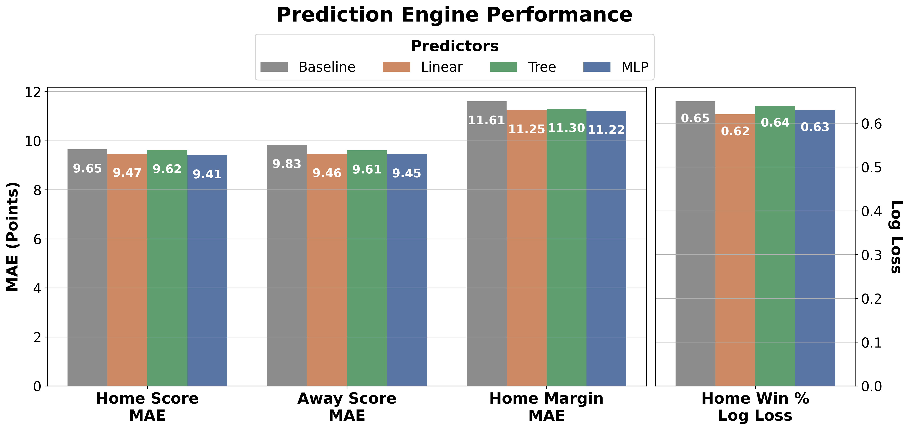

# NBA AI

## Table of Contents
* [Project Overview](#project-overview)
    * [Current State](#current-state)
    * [Future Goals](#future-goals)
    * [Guiding Principles](#guiding-principles)
* [Web App](#web-app)
* [Prediction Engines](#prediction-engines)
* [Development Status](#development-status)

## Project Overview

#### Using AI to predict the outcomes of NBA games.

This project aims to streamline the process of predicting NBA game outcomes by focusing on advanced AI prediction models rather than extensive data collection and management. Unlike my previous project, [NBA Betting](https://github.com/NBA-Betting/NBA_Betting/tree/main), which aimed to create a comprehensive feature set for predicting NBA games through extensive data collection, this project simplifies the process. While the previous approach benefited from various industry-derived metrics, the cost and complexity of managing the data collection were too high. This project focuses on a core data set, such as play-by-play data, and leverages deep learning and GenAI to predict game outcomes.

### Current State

The project is in active development with a complete data collection pipeline and basic prediction engines. **Recent infrastructure cleanup (Nov 2025)** removed unnecessary complexity (Airflow orchestration, Wandb experiment tracking) to focus on the core GenAI prediction engine development.

The current system processes 3 seasons of data (2023-2026) with complete PBP → GameStates → PlayerBox/TeamBox → Features → Predictions pipeline. The web app provides a simple interface for displaying games with current scores and predictions.



The project is built around a few key components:
* **Database Updater**: This component is responsible for updating the database with the latest NBA game data. It fetches data from the NBA Stats API, performs ETL operations, generates features, creates predictions, and stores the data in a SQLite database. It consists of a few modules:
    * `database_update_manager.py`: The main module that orchestrates the entire process.
    * `schedule.py`: Fetches the schedule from the NBA API and updates the database.
    * `pbp.py`: Fetches play-by-play data for games and updates the database.
    * `game_states.py`: Parses play-by-play data to generate game states and updates the database.
    * `prior_states.py`: Determines prior final game states for teams.
    * `features.py`: Uses prior final game states to generate features for the prediction engine.
    * `predictions.py`: Generates predictions for games using the chosen prediction engine.

* **Games API**: This component is responsible for updating predictions for ongoing or completed games and providing the data to the web app. It fetches data from the database, generates predictions, and serves the data to the web app.
    * `games.py`: Fetches game data from the database, manages prediction updating and data formatting.
    * `api.py`: Defines the API endpoints.

* **Web App**: This component is the front end of the project, providing a simple interface for users to view games and predictions. It is built using Flask.
    * `start_app.py`: The main entry point for the web app found in the root directory.
    * `app.py`: The main module that defines the Flask app and routes.
    * `game_data_processor.py`: Formats game data from the API for the web app.
    * `templates/`: Contains the HTML templates for the web app.
    * `static/`: Contains the CSS and JavaScript files for the web app.

### Future Goals


1. **Data Sourcing**: Focus on a minimal number of data sources that fundamentally describe basketball. Currently, we use play-by-play data from the NBA API. In the future, incorporating video and tracking data would be interesting, though these require considerably more resources and access.

2. **Prediction Engine**: This is the core of the project and will be the development focus until the 2024-2025 season begins. The current prediction engine options will be replaced with a DL and GenAI-based engine, allowing for decreased data parsing and feature engineering while also scaling to predict more complex outcomes, including individual player performance.

3. **Data Storage**: Future data storage will more seamlessly integrate with the prediction engine. The storage requirements will combine the current SQL-based data used for the API and web app with more advanced vector-based storage for RAG-based GenAI models.

4. **Web App**: This is the project's front end, displaying the games for the selected date along with current scores and predictions. The interface will remain simple while usability is gradually improved. A separate GenAI chat will be added in the future to allow users to interact with the prediction engine and modify individual predictions based on their preferences.

### Guiding Principles


- **Time Series Data Inclusive:** A focus on incorporating the sequential nature of events in games and across seasons, recognizing the significance of order and timing in the NBA.
- **Minimal Data Collection:** Streamlining data sourcing to the essentials, aiming for maximum impact with minimal data, thereby reducing time and resource investment.
- **Wider Applicability:** Extending the scope to cover more comprehensive outcomes, moving beyond standard predictions like point spreads or over/unders.
- **Advanced Modeling System:** Developing a system that is not only a learning tool but also potentially novel compared to the methods used by odds setters.
- **Minimal Human Decisions:** Reducing the reliance on human decision-making to minimize errors and the limitations of individual expertise.

## Web App




## Prediction Engines

Currently, there are a few basic prediction engines used to predict the outcomes of NBA games. These serve as placeholders for the more advanced DL and GenAI engines that will be implemented in the future. The current engines make pre-game predictions for home and away scores using ML models. These predictions are then used to calculate the win percentage and margin for the home team. Updated (after game start) predictions are based on a combination of the current game score, time remaining, and the pre-game predictions.

### Current Prediction Engines

- **Baseline**: A simple predictor that predicts scores based on teams' PPG and opponents' PPG.
- **Linear**: Ridge Regression model using 43 rolling average features from prior game states.
- **Tree**: XGBoost model using the same features as the Linear model.
- **MLP**: PyTorch MLP model using the same features as the Linear model.
- **Ensemble**: Weighted average of Linear (30%), Tree (40%), and MLP (30%) predictions.


### Performance Metrics

The current metrics are based on pre-game predictions for the home and away team scores, along with downstream metrics such as win percentage and margin. These simple predictors currently outperform the baseline predictor.

In the future, a more challenging baseline based on the Vegas spread will be added when the DL and GenAI models are implemented.



## Quick Start

### Requirements

- Python 3.10+
- ~500MB disk space (database + models + dependencies)

### Installation

```bash
# Clone the repository
git clone https://github.com/NBA-Betting/NBA_AI.git
cd NBA_AI

# Run automated setup
python setup.py
```

The setup script will:

1. Create a virtual environment
2. Install all dependencies
3. Download the database and trained models from GitHub Releases
4. Create your `.env` configuration file
5. Verify the installation

### Running the Web App

```bash
# Activate the virtual environment
source venv/bin/activate

# Start the web app
python start_app.py
```

Visit `http://localhost:5000` to view games and predictions.

### Command Line Options

```bash
# Use a specific predictor
python start_app.py --predictor=Tree

# Enable debug mode
python start_app.py --debug

# Set log level
python start_app.py --log_level=DEBUG
```

Available predictors: `Baseline`, `Linear`, `Tree`, `MLP`, `Ensemble`

---

## Development Status

**This project is in active development.**

The core data pipeline and prediction engines are functional. The focus is now on building advanced DL/GenAI prediction engines using play-by-play data.

> **Note:** Development has been slower than expected as I've been focused on other projects. I'm now refocusing on NBA AI and will be more responsive to issues and messages. Thanks for your patience!

### Historical Data

The default setup downloads only the current season. A database with seasons 2023-2024 through 2025-2026 is available from [GitHub Releases](https://github.com/NBA-Betting/NBA_AI/releases) as `NBA_AI_2023_2025.sqlite`.

To use it, update your `.env`:

```bash
DATABASE_PATH=data/NBA_AI_2023_2025.sqlite
```

### Usage Notes

- **First run for new seasons**: When viewing a date in a new season, the app fetches play-by-play data from the NBA API. This initial update may take several minutes as it makes API calls for each game. Subsequent views are fast since data is cached in the database.

- **Season restrictions**: By default, the web app is limited to recent seasons to prevent excessive API calls. To enable additional seasons, modify `valid_seasons` in `config.yaml`:

```yaml
api:
  valid_seasons:
    - "2023-2024"
    - "2024-2025"
    - "2025-2026"
```

### Technical Notes

- Default focus: 2025-2026 season (current season for public release)
- Database: SQLite with TEXT-based schema
- Data pipeline: Schedule → PBP → GameStates → PlayerBox/TeamBox → Features → Predictions
- Built with Python, Flask, SQLite, PyTorch, scikit-learn, and nba_api


