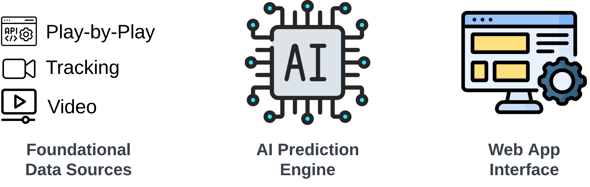

# NBA AI

Using AI to predict the outcomes of NBA games.

## Table of Contents
1. [Project Overview](#project-overview)
2. [Installation and Setup](#installation-and-setup)
3. [Prediction Engines](#prediction-engines)
4. [Additional Information](#additional-information)

## Project Overview
This project aims to streamline the process of predicting NBA game outcomes by shifting the focus from extensive data management to advanced AI prediction models. This approach contrasts with the comprehensive data collection method used in my previous project, [NBA Betting](https://github.com/NBA-Betting/NBA_Betting/tree/main). The project comprises three main components:

1. **Data Sourcing**: The focus is on a minimal number of data sources that fundamentally describe basketball. Currently, we use play-by-play data from the NBA API, but we're also considering video and tracking data.

2. **Prediction Engine**: This AI model predicts NBA game outcomes. We're currently using simple models like linear regression, XGBoost, and a basic MLP, which require extensive data preprocessing and feature engineering. As the project evolves, we'll implement more advanced deep learning models and GenAI tools, reducing the need for data preprocessing and feature engineering. This shift will also decrease reliance on human decision-making and increase the use of AI, allowing the predictions to scale with advancements in GenAI and other technologies. Currently, the prediction engine is limited to basic game score predictions and win percentages, but future developments will enable predictions of more complex outcomes like player and team performance.

3. **Web App**: This is the project's front end, displaying the games for the selected date along with current scores and predictions. The interface will remain simple while usability is gradually improved. A separate GenAI chat will be added in the future to allow users to interact with the prediction engine and modify individual predictions based on their preferences.

### Guiding Principles

- **Time Series Data Inclusive:** A focus on incorporating the sequential nature of events in games and across seasons, recognizing the significance of order and timing in the NBA.
- **Minimal Data Collection:** Streamlining data sourcing to the essentials, aiming for maximum impact with minimal data, thereby reducing time and resource investment.
- **Wider Applicability:** Extending the scope to cover more comprehensive outcomes, moving beyond standard predictions like point spreads or over/unders.
- **Advanced Modeling System:** Developing a system that is not only a learning tool but also potentially novel compared to the methods used by odds setters.
- **Minimal Human Decisions:** Reducing the reliance on human decision-making to minimize errors and the limitations of individual expertise.

## Installation and Setup
Instructions on how to install and setup the project will be provided here.

## Prediction Engines
This section will discuss the current prediction engine with a graph and future GenAI based prediction engine.

## Additional Information

### Web App Performance

### Current Focus and Future Additions
- Create a GenAI based prediction engine
- Consolidate betting data into database

### Recognition
swar nba, sportsdataverse/hoopr

### Contact Info
If you have any questions or would like to discuss potential opportunities, please don't hesitate to reach out. You can contact me via Github message or at [jeffjohannsen7@gmail.com](mailto:jeffjohannsen7@gmail.com). I am also open to job opportunities and collaborations.