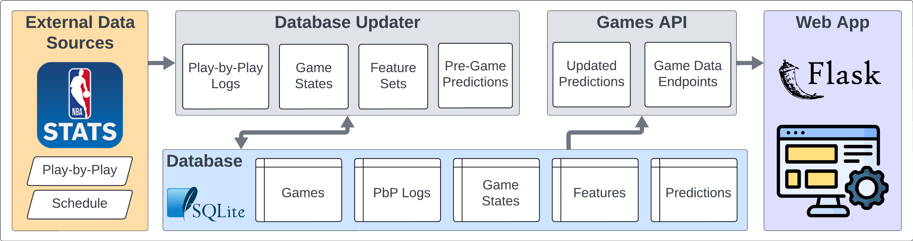
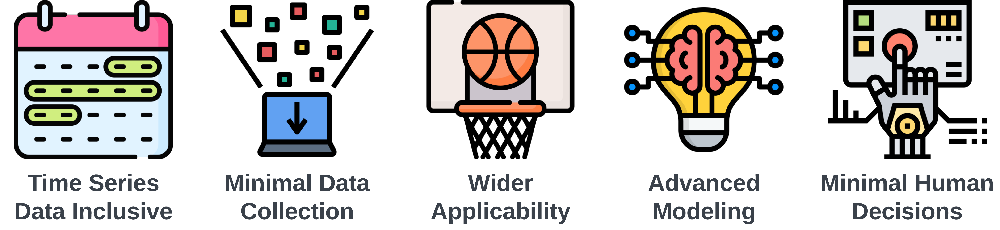
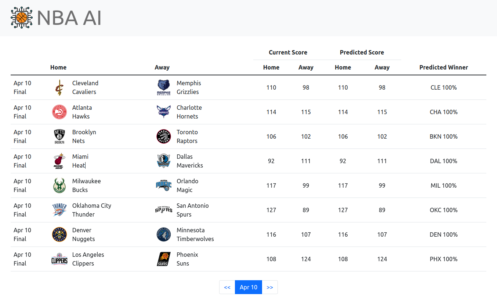
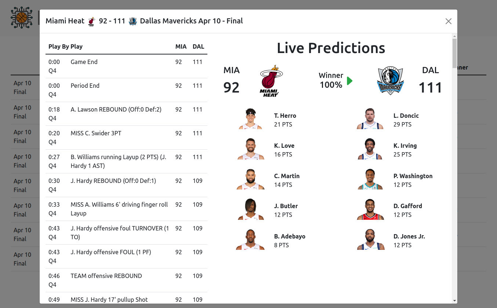
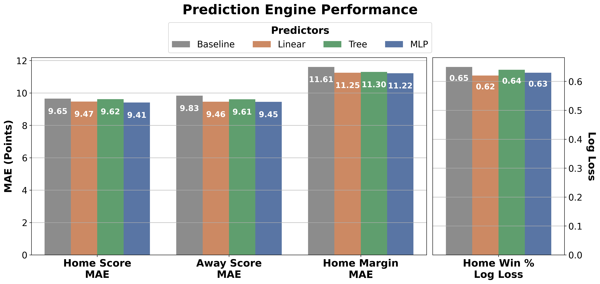

# NBA AI

## Table of Contents
* [Project Overview](#project-overview)
    * [Architecture](#architecture)
    * [Guiding Principles](#guiding-principles)
* [Web App & Dashboard](#web-app--dashboard)
* [Prediction Engines](#prediction-engines)
* [Quick Start](#quick-start)

## Project Overview

#### Using AI to predict the outcomes of NBA games.

This project predicts NBA game spreads and winners using a combination of deep learning models and traditional ML. Unlike my previous project, [NBA Betting](https://github.com/NBA-Betting/NBA_Betting/tree/main), which focused on extensive data collection and feature engineering, this project focuses on building advanced prediction models that learn directly from play-by-play data, box scores, and player tracking — minimizing manual feature engineering in favor of letting the models find the signal.

The system runs a fully automated daily pipeline that collects game data, updates player ability models, and generates pre-game predictions for all upcoming games using multiple prediction engines. A Flask web app displays predictions alongside Vegas opening lines, with a dashboard for tracking model performance over time.

### Architecture

The system has three main layers:

* **Data Collection** — Automatically collects game data, box scores, play-by-play, injury reports, and betting lines from the NBA API and ESPN into a SQLite database.

* **Prediction Models** — Multiple prediction engines analyze the data and generate pre-game spread and winner predictions. Includes custom deep learning models, traditional ML models, and an ensemble.

* **Web App & Dashboard** — Displays games with predictions alongside Vegas lines and actual results. A dashboard tracks each model's performance over time.



### Guiding Principles



- **Time Series Data Inclusive:** Incorporating the sequential nature of events in games and across seasons, recognizing the significance of order and timing in the NBA.
- **Minimal Data Collection:** Streamlining data sourcing to the essentials, aiming for maximum impact with minimal data, thereby reducing time and resource investment.
- **Wider Applicability:** Extending the scope to cover more comprehensive outcomes, moving beyond standard predictions like point spreads or over/unders.
- **Advanced Modeling System:** Developing a system that is not only a learning tool but also potentially novel compared to the methods used by odds setters.
- **Minimal Human Decisions:** Reducing the reliance on human decision-making to minimize errors and the limitations of individual expertise.

## Web App & Dashboard





## Prediction Engines

The system runs multiple prediction engines, each taking a different approach to predicting game spreads and winners. All engines generate pre-game predictions that are evaluated against Vegas closing lines.

### Deep Learning Models

- **Phase 5 (Hierarchical)**: A 4-level neural architecture that models basketball from the ground up — individual player abilities (L1, Kalman filter), player synergy (L2, GATv2), team effects (L3), and game-level matchup prediction (L4). ~1.4M parameters, trained on play-by-play and box score data.

- **Phase 3 (Transformer)**: A roster-conditioned temporal transformer that processes each team's full season history with player-level attention. ~25M parameters, captures game-to-game dynamics and roster interactions.

### Traditional ML Models

- **Baseline**: Formula-based predictor using team PPG and opponent PPG averages.
- **Linear**: Ridge Regression on 43 rolling features from prior game states.
- **Tree**: XGBoost on the same features, with Optuna-tuned hyperparameters.
- **MLP**: PyTorch neural network (256→128→64) with batch normalization and Huber loss.

### Ensemble

- **Ensemble**: Equal-weight combination of all five models above. Averages spreads arithmetically and win probabilities in log-odds space.

### Performance

All models are evaluated against the spread (ATS) using Vegas closing lines. Performance chart will be updated once sufficient live data has accumulated.

<!-- Regenerate with: python scripts/generate_readme_chart.py -->
<!--  -->

## Quick Start

### Requirements

- Python 3.10+
- PyTorch (required for MLP predictor; optional for others)
- ~2GB disk space (starter database expands to ~1.4GB)

### 1. Install

```bash
git clone https://github.com/NBA-Betting/NBA_AI.git
cd NBA_AI

python -m venv venv
source venv/bin/activate  # Windows: venv\Scripts\activate
pip install -r requirements.txt

cp .env.example .env
```

### 2. Download the Starter Database

Download `NBA_AI_starter.sqlite.gz` from [GitHub Releases](https://github.com/NBA-Betting/NBA_AI/releases) into the project root, then extract it:

```bash
python -c "import gzip, shutil; shutil.copyfileobj(gzip.open('NBA_AI_starter.sqlite.gz','rb'), open('data/NBA_AI_starter.sqlite','wb'))"
```

The starter database contains the current season's games, box scores, play-by-play, betting lines, injury reports, and predictions from all models. The `.env` file is already configured to use it.

### 3. Run the Web App

```bash
python start_app.py
# If port 5000 is already in use (for example, by macOS AirPlay Receiver):
python start_app.py --port 5001
```

Visit `http://localhost:5000` to view games and predictions. The dashboard is at `/dashboard`.

The web app shows whatever is in the database. With a fresh starter DB, you'll see the full season up to the date it was exported.

### 4. Update Data

The web app does not fetch new data on its own. To collect games that have occurred since the starter database was exported, run the pipeline:

```bash
python -m src.pipeline.orchestrator --mode=full --season=Current
```

> **Note:** On first run, the pipeline will backfill any missing games since the starter DB was exported. This involves many API calls with rate-limit pauses and **may take 10-30+ minutes** depending on the gap. Subsequent runs complete in 1-2 minutes.

To keep data current, run the pipeline manually whenever you want, or optionally set up a cron job (Linux/Mac):

```bash
# Automated (add via 'crontab -e')
# Note: cron schedules use your system's local timezone. Pick an hour that is
# morning US Eastern for you (e.g. 10am ET = "0 7" on a US Pacific machine),
# so the run lands after the previous night's games and before the day's games.
0 10 * * * cd /path/to/NBA_AI && venv/bin/python -m src.pipeline.orchestrator --mode=full --season=Current >> logs/cron_daily.log 2>&1
```

### Included Models

The repository includes trained models for four predictors that work out of the box:

| Model | Type | Description |
|-------|------|-------------|
| **Baseline** | Formula | Team PPG averages (no model file needed) |
| **Linear** | Ridge Regression | 43 rolling features from prior game states |
| **Tree** | XGBoost | Same features, Optuna-tuned hyperparameters |
| **MLP** | Neural Network | 256-128-64 architecture with Huber loss |

These models are combined by the **Ensemble** predictor (equal-weight average).

The deep learning models (**Phase5** and **Phase3**) are not included due to size. To use them, train your own using the scripts in `scripts/`. To retrain the legacy models on updated data:

```bash
python scripts/train_legacy_models.py --cutoff-date 2026-03-31
```

---

*This is a personal side project provided "as is" with no guarantees of quality, functionality, or ongoing maintenance.*
